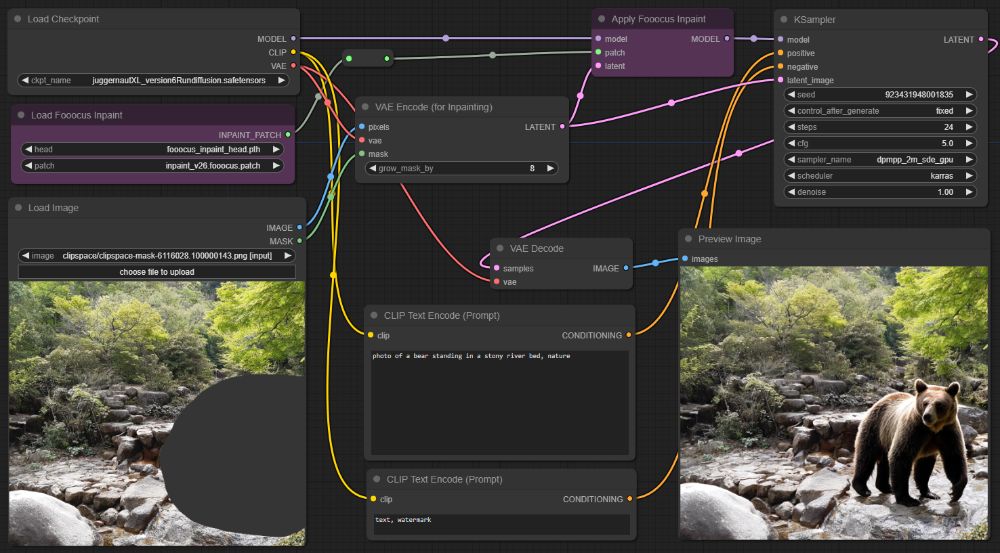

# ComfyUI Inpaint Nodes

Experimental nodes for better inpainting with ComfyUI.

## Fooocus Inpaint

Adds two nodes which allow using [Fooocus](https://github.com/lllyasviel/Fooocus) inpaint model. It's a small and flexible patch which can be applied to _any **SDXL** checkpoint_ and will transform it into an inpaint model. This model can then be used like other inpaint models, and provides the same benefits. [Read more](https://github.com/lllyasviel/Fooocus/discussions/414)

Download models from [lllyasviel/fooocus_inpaint](https://huggingface.co/lllyasviel/fooocus_inpaint/tree/main) to `ComfyUI/models/inpaint`.

Note: Implementation is somewhat hacky as it monkey-patches ComfyUI's `ModelPatcher` to support the custom Lora format which the model is using.

## Example Workflows

Example workflows can be found in [workflows](workflows).

* **[Inpaint](https://raw.githubusercontent.com/Acly/comfyui-inpaint-nodes/main/workflows/inpaint.json):** ignore previous content, 100% replacement, prompt required  
* **[Refine](https://raw.githubusercontent.com/Acly/comfyui-inpaint-nodes/main/workflows/refine.json):** modify previous content, 1-99% denoise strength, prompt required
