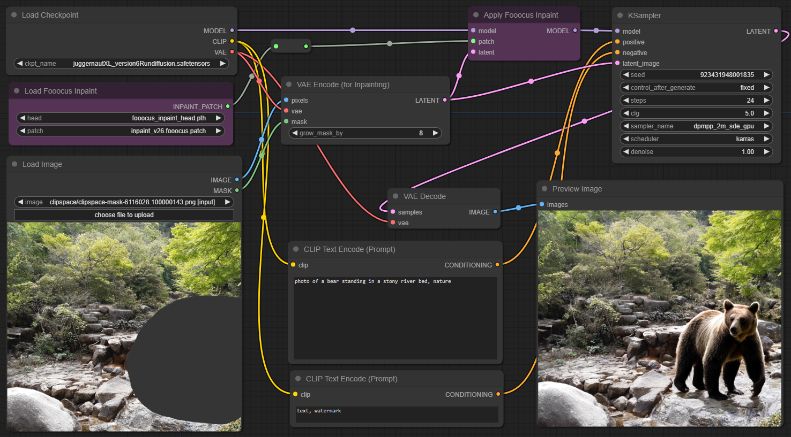
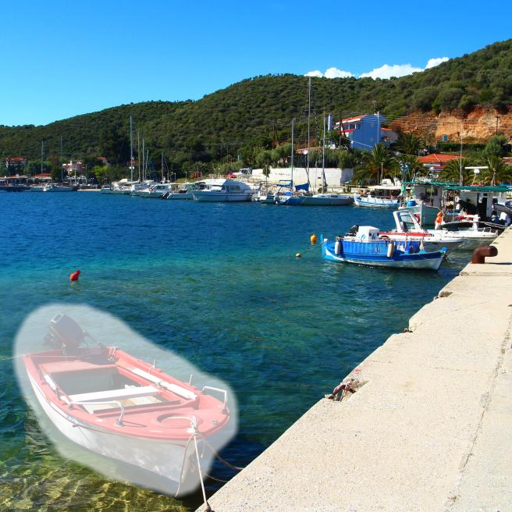
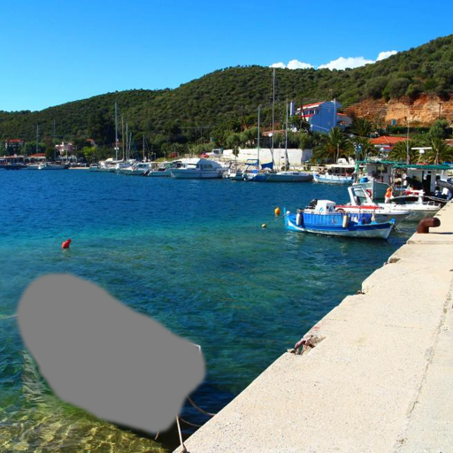
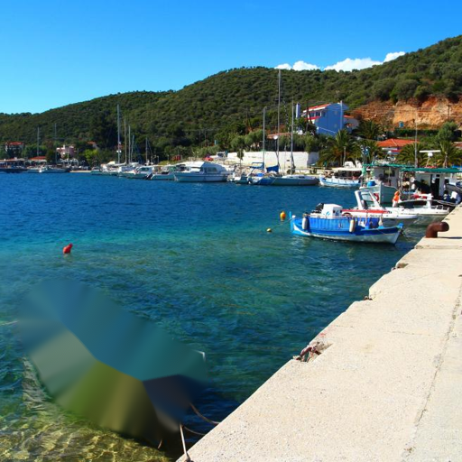
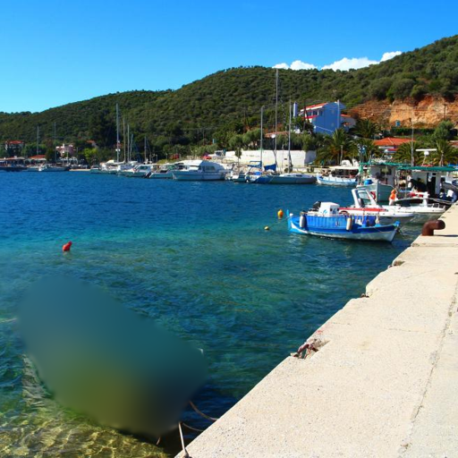

# ComfyUI Inpaint Nodes

Nodes for better inpainting with ComfyUI: Fooocus inpaint model for SDXL, LaMa, MAT,
and various other tools for pre-filling inpaint & outpaint areas.


## Fooocus Inpaint

Adds two nodes which allow using [Fooocus](https://github.com/lllyasviel/Fooocus) inpaint model.
It's a small and flexible patch which can be applied to your _**SDXL** checkpoints_ and
will transform them into an inpaint model. This model can then be used like other inpaint
models to seamlessly fill and expand areas in an image.

Download models from [lllyasviel/fooocus_inpaint](https://huggingface.co/lllyasviel/fooocus_inpaint/tree/main) and place them into `ComfyUI/models/inpaint`.



> [!NOTE]
> 
> Make sure to use the regular version of a checkpoint to create an inpaint model - distilled merges (Turbo, Lightning, Hyper) do not work.


## Inpaint Conditioning

Fooocus inpaint can be used with ComfyUI's _VAE Encode (for Inpainting)_ directly. However this does
not allow existing content in the masked area, denoise strength must be 1.0.

_InpaintModelConditioning_ can be used to combine inpaint models with existing content. The resulting
latent can however _not_ be used directly to patch the model using _Apply Fooocus Inpaint_. This repository
adds a new node **VAE Encode & Inpaint Conditioning** which provides two outputs: `latent_inpaint` (connect
this to _Apply Fooocus Inpaint_) and `latent_samples` (connect this to _KSampler_).

It's the same as using both _VAE Encode (for Inpainting)_ and _InpaintModelConditioning_, but less overhead
because it avoids VAE-encoding the image twice. [Example workflow](workflows/inpaint-refine.json)


## Inpaint Pre-processing

Several nodes are available to fill the masked area prior to inpainting. They avoid seams as long as the
input mask is large enough.

### Expand Mask

Expands (grow) the mask area by a certain number of pixels, and blurs (feather) the mask for a smoother transition at the edges.

### Fill Masked

This fills the masked area, with a smooth transition at the border. It has 3 modes:
* `neutral`: fills with grey, good for adding entirely new content
* `telea`: fills with colors from surrounding border (based on algorithm by Alexandru Telea)
* `navier-stokes`: fills with colors from surrounding border (based on fluid dynamics described by Navier-Stokes)

| Input | Neutral | Telea | Navier-Stokes |
|-|-|-|-|
|  |  |  | 

### Blur Masked

This blurs the image into the masked area. The blur is less strong at the borders of the mask.
Good for keeping the general colors the same.

| Input | Blur radius 17 | Blur radius 65 |
|-|-|-|
|  |  |  |

### Inpaint Models (LaMA, MAT)

This runs a small, fast inpaint model on the masked area. Models can be loaded with **Load Inpaint Model**
and are applied with the **Inpaint (using Model)** node. This works well for outpainting or object removal.

The following inpaint models are supported, place them in `ComfyUI/models/inpaint`:
- [LaMa](https://github.com/advimman/lama) | [Model download](https://github.com/Sanster/models/releases/download/add_big_lama/big-lama.pt)
- [MAT](https://github.com/fenglinglwb/MAT) | [Model download](https://github.com/Sanster/models/releases/download/add_mat/Places_512_FullData_G.pth) | [Model download (fp16 safetensors)](https://huggingface.co/Acly/MAT/resolve/main/MAT_Places512_G_fp16.safetensors)

| Input | LaMa | MAT |
|-|-|-|
|  |  |  |


## Inpaint Post-processing

### Denoise to Compositing Mask

Takes a _mask_, an _offset_ (default 0.1) and a _threshold_ (default 0.2).
Maps mask values in the range of \[_offset_ → _threshold_\] to \[0 → 1\].
Values below offset are clamped to 0, values above threshold to 1.

This is particularly useful in combination with ComfyUI's "Differential Diffusion" node, which allows to use a mask as per-pixel denoise strength.
Using the same mask for compositing (alpha blending) defeats the purpose, but no blending at all degrades quality in regions with zero or very low strength. This node creates a mask suitable for blending from the denoise-mask.


## Example Workflows

Example workflows can be found in [workflows](workflows).

* **[Simple](https://raw.githubusercontent.com/Acly/comfyui-inpaint-nodes/main/workflows/inpaint-simple.json):** basic workflow, ignore previous content, 100% replacement
* **[Refine](https://raw.githubusercontent.com/Acly/comfyui-inpaint-nodes/main/workflows/inpaint-refine.json):** advanced workflow, refine existing content, 1-100% denoise strength
* **[Outpaint](https://raw.githubusercontent.com/Acly/comfyui-inpaint-nodes/main/workflows/outpaint.json):** workflow for outpainting with pre-processing
* **[Pre-process](https://raw.githubusercontent.com/Acly/comfyui-inpaint-nodes/main/workflows/inpaint-preprocess.json):** complex workflow for experimenting with pre-processors
* **[Promptless](https://raw.githubusercontent.com/Acly/comfyui-inpaint-nodes/main/workflows/inpaint-promptless.json):** same as above but without text prompt, requires [IP-Adapter](https://github.com/cubiq/ComfyUI_IPAdapter_plus)


## Installation

Use [ComfyUI Manager](https://github.com/ltdrdata/ComfyUI-Manager) and search for "ComfyUI Inpaint Nodes".

_**or**_ download the repository and put the folder into `ComfyUI/custom_nodes`.

_**or**_ use GIT:
```
cd ComfyUI/custom_nodes
git clone https://github.com/Acly/comfyui-inpaint-nodes.git
```

Restart ComfyUI after installing!

---

OpenCV is required for _telea_ and _navier-stokes_ fill mode:
```
pip install opencv-python
```

## Acknowledgements

* Fooocus Inpaint: [lllyasviel/Fooocus](https://github.com/lllyasviel/Fooocus)
* LaMa: [advimman/lama](https://github.com/advimman/lama)
* MAT: [fenglinglwb/MAT](https://github.com/fenglinglwb/MAT)
* LaMa/MAT implementation: [chaiNNer-org/spandrel](https://github.com/chaiNNer-org/spandrel)
